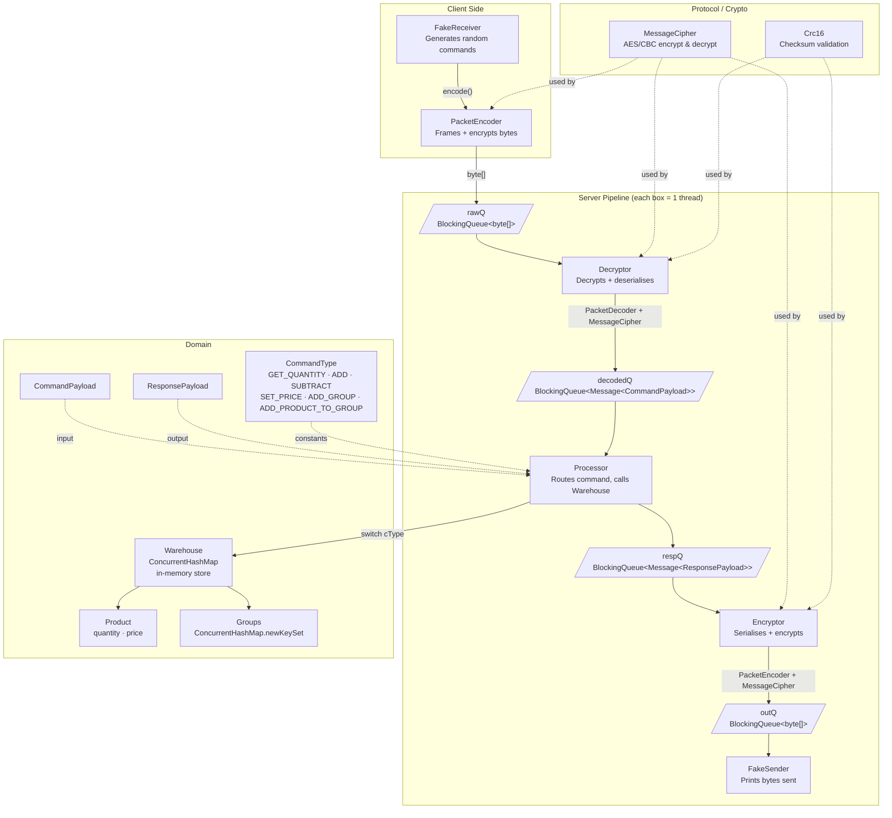

# Architecture Diagram

```mermaid
flowchart TD
    subgraph Client["Client Side"]
        FC[FakeReceiver\nGenerates random commands]
        PE[PacketEncoder\nFrames + encrypts bytes]
    end

    subgraph Protocol["Protocol / Crypto"]
        MC[MessageCipher\nAES/CBC encrypt & decrypt]
        CRC[Crc16\nChecksum validation]
    end

    subgraph Pipeline["Server Pipeline (each box = 1 thread)"]
        rawQ[/"rawQ\nBlockingQueue&lt;byte[]&gt;"/]
        DEC[Decryptor\nDecrypts + deserialises]
        decodedQ[/"decodedQ\nBlockingQueue&lt;Message&lt;CommandPayload&gt;&gt;"/]
        PROC[Processor\nRoutes command, calls Warehouse]
        respQ[/"respQ\nBlockingQueue&lt;Message&lt;ResponsePayload&gt;&gt;"/]
        ENC[Encryptor\nSerialises + encrypts]
        outQ[/"outQ\nBlockingQueue&lt;byte[]&gt;"/]
        FS[FakeSender\nPrints bytes sent]
    end

    subgraph Domain["Domain"]
        WH[Warehouse\nConcurrentHashMap\nin-memory store]
        PR[Product\nquantity · price]
        GR[Groups\nConcurrentHashMap.newKeySet]
        CP[CommandPayload]
        RP[ResponsePayload]
        CT[CommandType\nGET_QUANTITY · ADD · SUBTRACT\nSET_PRICE · ADD_GROUP · ADD_PRODUCT_TO_GROUP]
    end

    FC -->|"encode()"| PE
    PE -->|"byte[]"| rawQ
    rawQ --> DEC
    DEC -->|"PacketDecoder + MessageCipher"| decodedQ
    decodedQ --> PROC
    PROC -->|"switch cType"| WH
    WH --> PR
    WH --> GR
    PROC --> respQ
    respQ --> ENC
    ENC -->|"PacketEncoder + MessageCipher"| outQ
    outQ --> FS

    MC -.->|used by| DEC
    MC -.->|used by| ENC
    MC -.->|used by| PE
    CRC -.->|used by| DEC
    CRC -.->|used by| ENC

    CP -.->|input| PROC
    RP -.->|output| PROC
    CT -.->|constants| PROC
```
